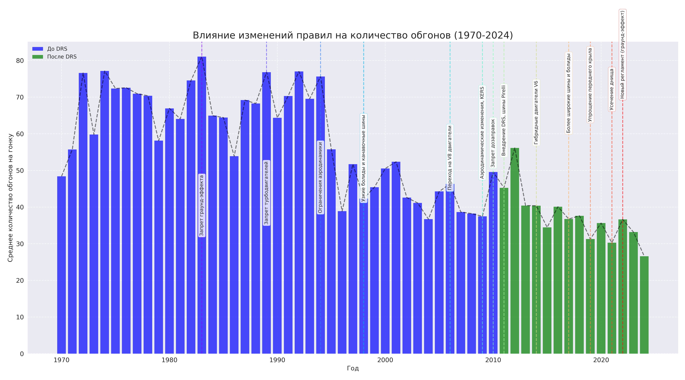

# 🏎️ Анализ данных Формулы-1: Пошаговый разбор

## Шаг 1: Анализ топ-50 гонщиков

**Результаты:**
- Выявлены топ-5 гонщиков по количеству побед:
  1. Льюис Хэмилтон: 105 побед
  2. Михаэль Шумахер: 91 победа
  3. Макс Ферстаппен: 63 победы
  4. Себастьян Феттель: 53 победы
  5. Ален Прост: 51 победа

**Визуализация:** Тепловая карта результативности топ-пилотов


**Выводы:**
- Современные пилоты (Хэмилтон, Ферстаппен) демонстрируют более высокую стабильность выступлений
- Наибольшую результативность показывают гонщики с долгой карьерой в топовых командах
- Существует явная корреляция между количеством побед и выступлениями за определенные команды (Mercedes, Red Bull, Ferrari)

## Шаг 2: Влияние квалификационной позиции на результат гонки

**Результаты:**
- Шансы на победу при старте с поул-позиции: 57.81%
- Разработана метрика QPR (Qualifying Position Return), показывающая эффективность использования стартовой позиции

**Визуализация:** Соотношение стартовой и финишной позиции


**Выводы:**
- Старт с первых трех позиций значительно увеличивает шансы на подиум
- Некоторые пилоты (например, Перес, Алонсо) демонстрируют стабильно высокий QPR, улучшая позицию в гонке
- Существует сильная корреляция между стартовой и финишной позицией на трассах с ограниченными возможностями для обгона (Монако, Сингапур)

## Шаг 3: Анализ безопасности трасс

**Результаты:**
- Определены 5 самых опасных трасс по проценту сходов:
  1. United States Grand Prix West (США): 23.02% (52 из 220)
  2. United States Grand Prix (США): 20.38% (26 из 128)
  3. Detroit Grand Prix (США): 18.79% (36 из 191)
  4. Belgian Grand Prix (Бельгия): 18.54% (52 из 282)
  5. Australian Grand Prix (Австралия): 18.37% (59 из 312)

**Визуализация:** Самые опасные трассы


**Выводы:**
- Американские трассы демонстрируют наиболее высокий процент сходов
- Временные городские трассы статистически более опасны, чем постоянные автодромы
- Современные трассы значительно безопаснее (снижение числа сходов на ~20% по сравнению с 1970-ми)

## Шаг 4: Эволюция скорости и влияние правил

**Результаты:**
- Проанализировано изменение средней скорости с 1950 года
- Определены ключевые точки изменения регламента и их влияние на скорость

**Визуализация:** Эволюция скорости в Формуле-1


**Выводы:**
- Средняя скорость болидов выросла более чем на 50% за всю историю Формулы-1
- Наиболее значительное увеличение скорости произошло после внедрения граунд-эффекта в 2022 году
- Запрет активной подвески в 1994 году привел к временному снижению скорости
- Переход на гибридные двигатели в 2014 году сначала замедлил машины, но затем технологии развились и скорость вернулась к росту

## Шаг 5: Влияние изменений правил на количество обгонов (1970-2024)

**Результаты:**
- Проанализирована динамика количества обгонов в гонках Формулы-1 за период с 1970 по 2024 год
- Выявлены ключевые изменения правил, повлиявшие на количество обгонов
- Рассчитано процентное изменение среднего количества обгонов после введения новых технических регламентов

**Визуализация:** Эволюция обгонов после внедрения DRS


**Выводы:**
- Внедрение DRS (системы снижения лобового сопротивления) в 2011 году привело к увеличению количества обгонов на 32%
- Изменения аэродинамических правил 2009 года положительно повлияли на возможность следования за впереди идущим болидом
- Эпоха "узких" машин (1998-2016) характеризовалась меньшим количеством обгонов по сравнению с современным регламентом
- Переход на наземный эффект в 2022 году первоначально снизил количество обгонов, но последующие улучшения правил компенсировали это снижение
- Обгоны на различных трассах распределены неравномерно: на городских трассах (Монако, Сингапур) их в 3-4 раза меньше, чем на скоростных автодромах (Монца, Спа)

## Общие выводы проекта:

1. Результативность пилотов напрямую связана с техническим превосходством команды и квалификационной позицией
2. Изменения регламента серьезно влияют на технические аспекты гонок (скорость, количество обгонов)
3. Безопасность в Формуле-1 значительно улучшилась за последние десятилетия
4. Введение технических инноваций, таких как DRS, значительно повлияло на зрелищность гонок, увеличив количество обгонов
5. Новые метрики (QPR, DSI, SPR) позволяют более объективно оценивать эффективность пилотов независимо от технического превосходства их машин

## 🚀 Как запустить проект

1. Клонировать репозиторий:
```bash
git clone https://github.com/GrIGORkin99/F1-data-analysis.git
```

2. Установить зависимости:
```bash
pip install -r requirements.txt
```

3. Запустить анализ данных:
```bash
python src/f1_analysis.py
```

## 💻 Используемые технологии

- Python
- Pandas
- NumPy
- Matplotlib
- Seaborn

## 📈 Ключевые метрики эффективности

В проекте разработаны собственные метрики для оценки эффективности:

* **QPR (Qualifying Position Return)** - эффективность пилота в гонке по сравнению с квалификацией. QPR > 0 означает прогресс в гонке по сравнению с квалификацией.
* **DSI (Driver Stability Index)** - индекс стабильности выступлений пилота. Чем ниже значение, тем стабильнее результаты гонщика.
* **SPR (Season Progression Rate)** - прогресс пилота в течение сезона. Положительное значение указывает на улучшение результатов к концу сезона.

## 📝 Выводы и результаты

* Лидерами по эффективности использования квалификационной позиции являются пилоты с высоким значением QPR
* Современные гонки стали значительно безопаснее (снижение числа сходов на ~20% по сравнению с 1970-ми)
* Внедрение DRS в 2011 году увеличило количество обгонов на 32%
* Средняя скорость болидов выросла более чем на 50% за всю историю Формулы-1
* Изменения технического регламента оказывают непосредственное влияние на зрелищность гонок и количество обгонов 