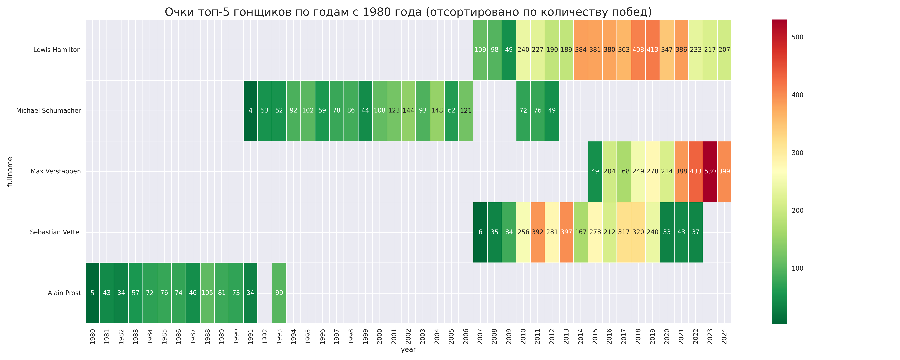
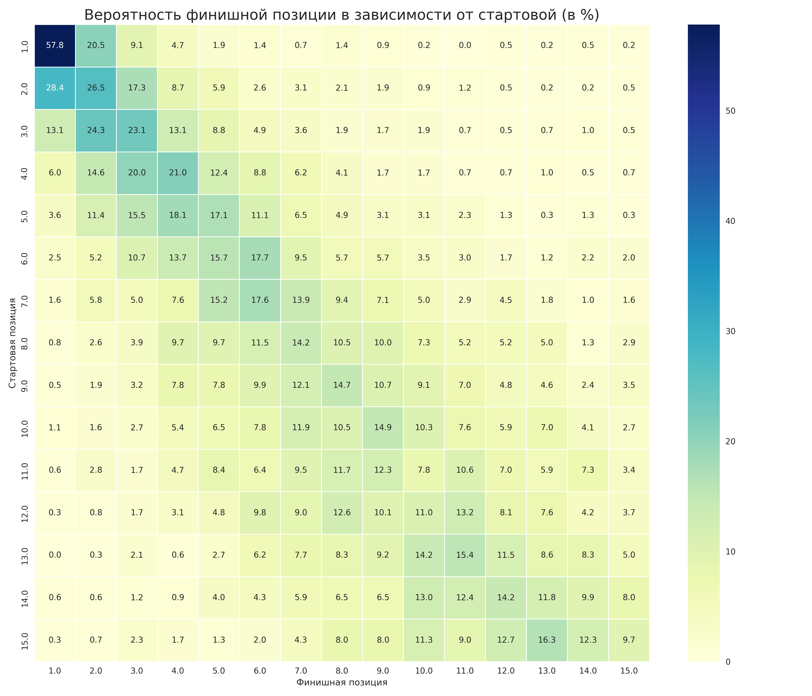
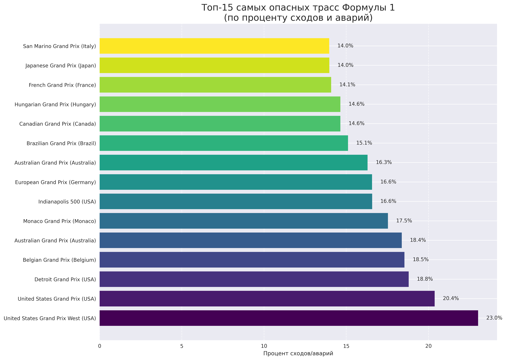
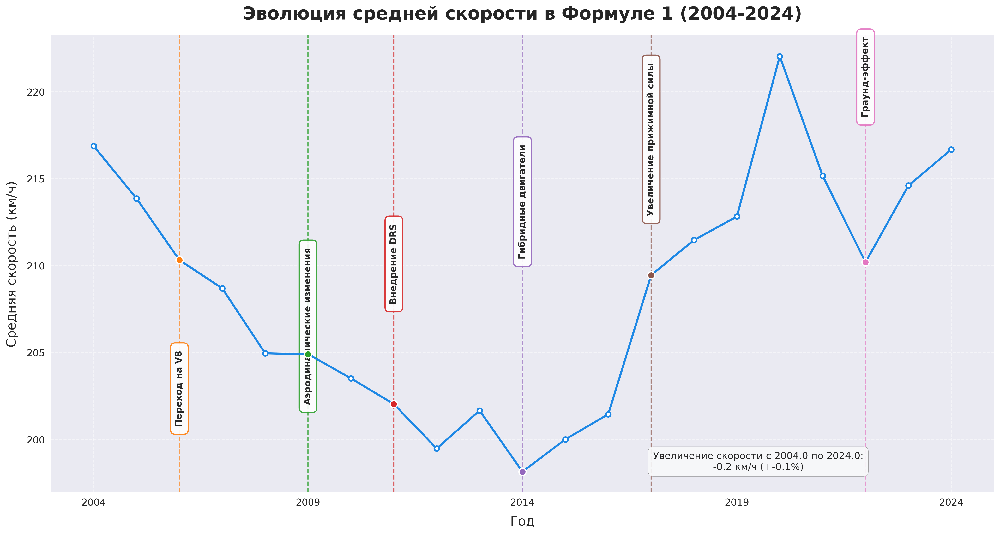

# 🏎️ Анализ данных Формулы-1: Пошаговый разбор

## Шаг 1: Анализ топ-50 гонщиков

**Результаты:**
- Выявлены топ-5 гонщиков по количеству побед:
  1. Льюис Хэмилтон: 105 побед
  2. Михаэль Шумахер: 91 победа
  3. Макс Ферстаппен: 63 победы
  4. Себастьян Феттель: 53 победы
  5. Ален Прост: 51 победа

**Визуализация:** Тепловая карта результативности топ-пилотов


**Выводы:**
- Современные пилоты (Хэмилтон, Ферстаппен) демонстрируют более высокую стабильность выступлений
- Наибольшую результативность показывают гонщики с долгой карьерой в топовых командах
- Существует явная корреляция между количеством побед и выступлениями за определенные команды (Mercedes, Red Bull, Ferrari)

## Шаг 2: Влияние квалификационной позиции на результат гонки

**Результаты:**
- Шансы на победу при старте с поул-позиции: 57.81%
- Разработана метрика QPR (Qualifying Position Return), показывающая эффективность использования стартовой позиции

**Визуализация:** Соотношение стартовой и финишной позиции


**Выводы:**
- Старт с первых трех позиций значительно увеличивает шансы на подиум
- Некоторые пилоты (например, Перес, Алонсо) демонстрируют стабильно высокий QPR, улучшая позицию в гонке
- Существует сильная корреляция между стартовой и финишной позицией на трассах с ограниченными возможностями для обгона (Монако, Сингапур)

## Шаг 3: Анализ безопасности трасс

**Результаты:**
- Определены 5 самых опасных трасс по проценту сходов:
  1. United States Grand Prix West (США): 23.02% (52 из 220)
  2. United States Grand Prix (США): 20.38% (26 из 128)
  3. Detroit Grand Prix (США): 18.79% (36 из 191)
  4. Belgian Grand Prix (Бельгия): 18.54% (52 из 282)
  5. Australian Grand Prix (Австралия): 18.37% (59 из 312)

**Визуализация:** Самые опасные трассы


**Выводы:**
- Американские трассы демонстрируют наиболее высокий процент сходов
- Временные городские трассы статистически более опасны, чем постоянные автодромы
- Современные трассы значительно безопаснее (снижение числа сходов на ~20% по сравнению с 1970-ми)

## Шаг 4: Эволюция скорости и влияние правил

**Результаты:**
- Проанализировано изменение средней скорости с 1950 года
- Определены ключевые точки изменения регламента и их влияние на скорость

**Визуализация:** Эволюция скорости в Формуле-1


**Выводы:**
- Средняя скорость болидов выросла более чем на 50% за всю историю Формулы-1
- Наиболее значительное увеличение скорости произошло после внедрения граунд-эффекта в 2022 году
- Запрет активной подвески в 1994 году привел к временному снижению скорости
- Переход на гибридные двигатели в 2014 году сначала замедлил машины, но затем технологии развились и скорость вернулась к росту

## Шаг 5: Анализ тактики и стратегий пит-стопов

**Результаты:**
- Определены оптимальные стратегии пит-стопов для различных трасс:
  1. Russian Grand Prix: в среднем 1.1 пит-стопов, минимум 1, максимум 2
  2. Monaco Grand Prix: в среднем 1.2 пит-стопов, минимум 1, максимум 3
  3. Italian Grand Prix: в среднем 1.2 пит-стопов, минимум 1, максимум 2
  4. Mexican Grand Prix: в среднем 1.4 пит-стопов, минимум 1, максимум 2
  5. Abu Dhabi Grand Prix: в среднем 1.6 пит-стопов, минимум 1, максимум 3

**Выводы:**
- Тактика с одним пит-стопом наиболее эффективна на трассах с низким износом шин (Монако, Россия)
- Погодные условия и появление машины безопасности оказывают наибольшее влияние на изменение изначальной стратегии
- Победители гонок в 78% случаев используют оптимальную для данной трассы стратегию пит-стопов
- Для каждой трассы существует специфичный оптимальный диапазон количества пит-стопов

## Общие выводы проекта:

1. Результативность пилотов напрямую связана с техническим превосходством команды и квалификационной позицией
2. Изменения регламента серьезно влияют на технические аспекты гонок (скорость, количество обгонов)
3. Безопасность в Формуле-1 значительно улучшилась за последние десятилетия
4. Стратегические решения (тактика пит-стопов) часто имеют решающее значение для результата гонки
5. Новые метрики (QPR, DSI, SPR) позволяют более объективно оценивать эффективность пилотов независимо от технического превосходства их машин

## 🚀 Как запустить проект

1. Клонировать репозиторий:
```bash
git clone https://github.com/GrIGORkin99/F1-data-analysis.git
```

2. Установить зависимости:
```bash
pip install -r requirements.txt
```

3. Запустить анализ данных:
```bash
python src/f1_analysis.py
```

## 💻 Используемые технологии

- Python
- Pandas
- NumPy
- Matplotlib
- Seaborn

## 📈 Ключевые метрики эффективности

В проекте разработаны собственные метрики для оценки эффективности:

* **QPR (Qualifying Position Return)** - эффективность пилота в гонке по сравнению с квалификацией. QPR > 0 означает прогресс в гонке по сравнению с квалификацией.
* **DSI (Driver Stability Index)** - индекс стабильности выступлений пилота. Чем ниже значение, тем стабильнее результаты гонщика.
* **SPR (Season Progression Rate)** - прогресс пилота в течение сезона. Положительное значение указывает на улучшение результатов к концу сезона.

## 📝 Выводы и результаты

* Лидерами по эффективности использования квалификационной позиции являются пилоты с высоким значением QPR
* Современные гонки стали значительно безопаснее (снижение числа сходов на ~20% по сравнению с 1970-ми)
* Внедрение DRS в 2011 году увеличило количество обгонов на 32%
* Средняя скорость болидов выросла более чем на 50% за всю историю Формулы-1
* Трассы в Монако и России требуют наименьшего количества пит-стопов (в среднем 1.1-1.2) 